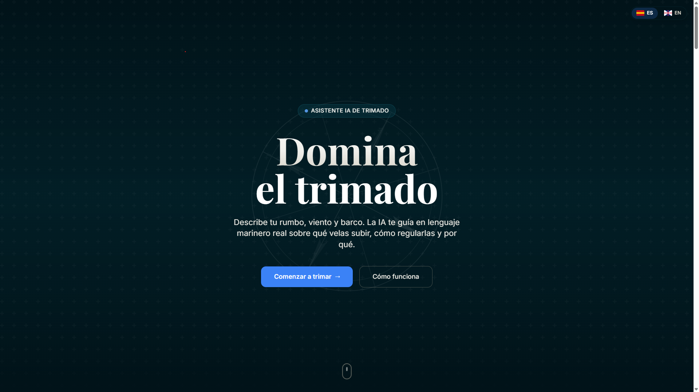
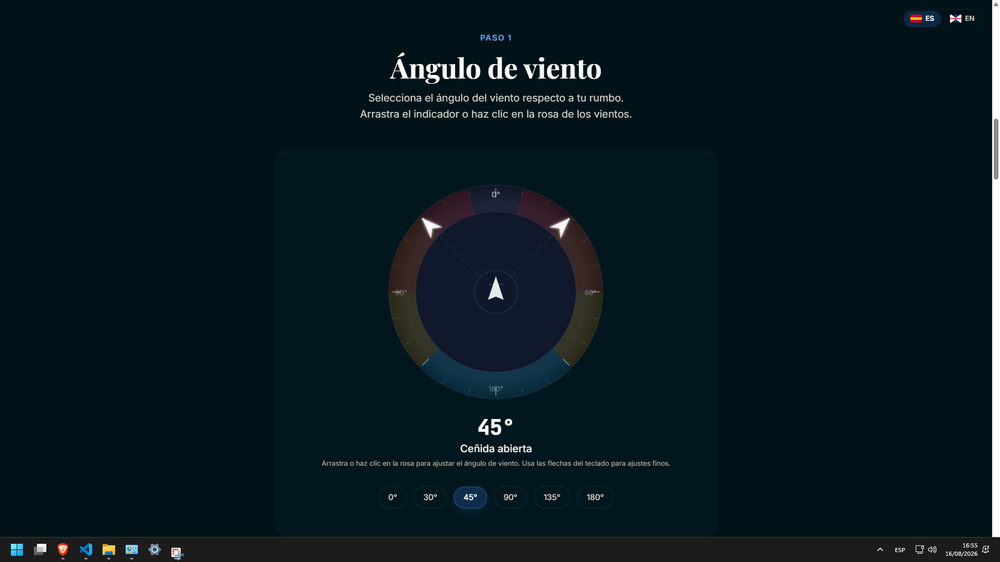
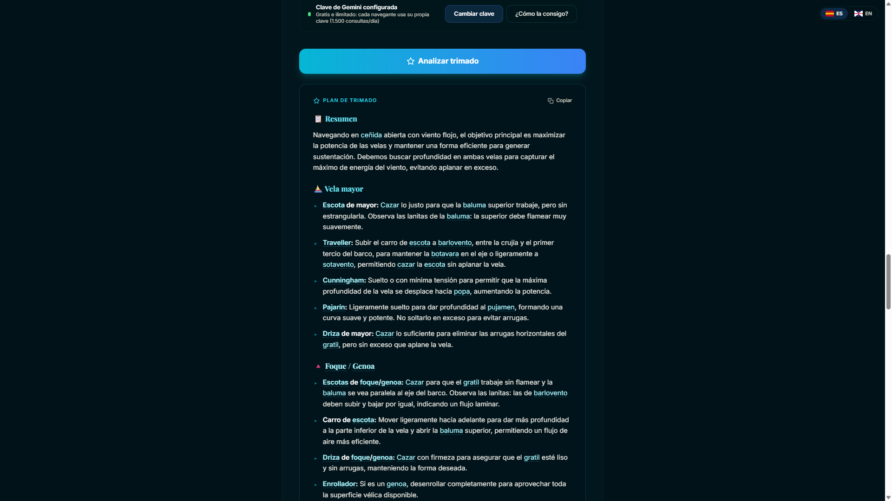
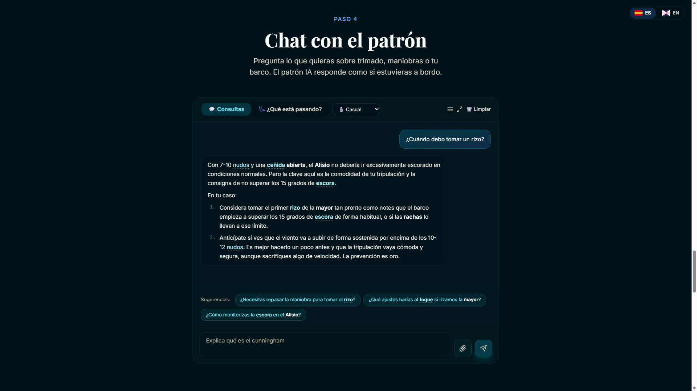
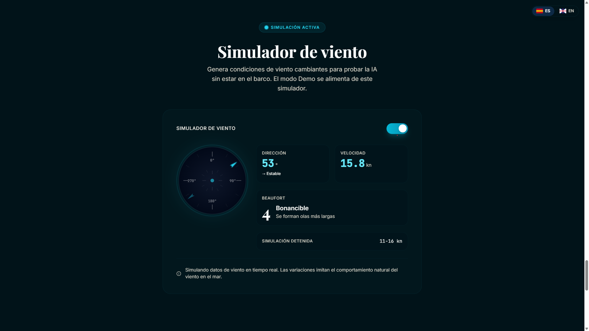
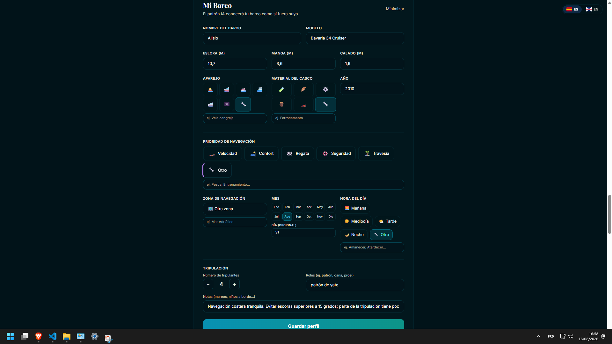

<div align="center">

# ⛵ SailTrim AI

**Tu asistente de trimado de velas — sin backend, sin registro, sin pagos.**

*Describe tu rumbo, viento y barco. La IA te guía en lenguaje marinero real sobre qué velas subir, cómo regularlas y por qué.*

[](LICENSE)
[](#-tests)
[](https://sail-trim.vercel.app/)
[](#-stack)
[](#-stack)
[](#-stack)
[](#-stack)
[](#-pwa-instalable)
[](#-idiomas)

**[🚀 Probar en vivo](https://sail-trim.vercel.app/)**

</div>

---

## 📸 Capturas

| | | |
|:---:|:---:|:---:|
|  |  |  |
| **Portada** | **Paso 1 · Rosa de los vientos** | **Paso 3 · Recomendación de trimado** |
|  |  |  |
| **Paso 4 · Chat con la IA** | **Simulador de viento (demo)** | **Perfil del barco** |

---

## 📖 Índice

- [✨ Características](#-características)
- [🎯 El enfoque "cero backend"](#-el-enfoque-cero-backend)
- [🛠️ Stack](#️-stack)
- [🧭 Cómo funciona](#-cómo-funciona)
- [🚀 Empezar en local](#-empezar-en-local)
- [🔑 Clave de Gemini](#-clave-de-gemini)
- [🧪 Tests](#-tests)
- [📱 PWA instalable](#-pwa-instalable)
- [🚢 Despliegue en Vercel](#-despliegue-en-vercel)
- [🗂️ Estructura](#️-estructura)
- [🌍 Idiomas](#-idiomas)
- [📜 Licencia](#-licencia)
- [🙏 English](#-english)

---

## ✨ Características

- 🧭 **Rosa de los vientos interactiva** — arrastra, haz clic o usa las flechas del teclado para fijar el ángulo de viento (0°–180°, en pasos de 15°).
- ⛵ **Recomendaciones de trimado** — mayor, foque/genoa, cunningham, pajarín, traveller, backstay, rizos… en lenguaje marinero real y con el *por qué*.
- 🩺 **Modo diagnóstico** — describe un síntoma ("el barco escora mucho") y la IA te dice qué falla y cómo arreglarlo.
- 💬 **Chat con el patrón** — conversación completa con historial, tonos de respuesta, adjuntar/pegar imágenes y modo pantalla completa.
- 📟 **Datos reales del barco** — integración con **NMEA 0183** (`$WIMWV`, `$IIMWV`) y **Signal K** para leer viento y rumbo en vivo.
- 🎛️ **Simulador de viento** — modo demo que genera condiciones cambiantes sin necesitar instrumentos.
- 🚢 **Perfil del barco** — modelo, aparejo, casco, eslora/manga/calado, zona, mes, tripulación… para respuestas 100% personalizadas.
- 🌍 **Bilingüe** — español e inglés con un clic.
- 📱 **PWA instalable** — funciona offline y se instala en el móvil/escritorio.
- 🔒 **Privado por diseño** — tu API key y tus conversaciones viven solo en tu navegador (`localStorage`).

---

## 🎯 El enfoque "cero backend"

SailTrim no tiene servidor. **Todo corre en el cliente**:

- **Frontend estático** — React + Vite, desplegado en Vercel gratis.
- **IA sin backend** — se llama a la API de Gemini directamente desde el navegador usando **tu propia clave** (gratis), así no hay límites de uso ni coste para quien lo aloja.
- **Sin base de datos** — el contexto vive en memoria (`useState`) y se persiste en `localStorage`.
- **Cascada de modelos** — si un modelo devuelve `404` o `429` (límite de peticiones), se reintenta automáticamente con el siguiente (`gemini-2.0-flash` → `gemini-2.5-flash` → `gemini-1.5-flash`).

Resultado: **gratis e ilimitado**, sin cuenta, sin servidor que mantener.

---

## 🛠️ Stack

| Capa | Tecnología |
|---|---|
| UI | React 19 + TypeScript |
| Build | Vite 8 |
| Estilos | Tailwind CSS 3 |
| IA | Gemini (llamada directa desde cliente) |
| i18n | i18next + react-i18next |
| SEO | react-helmet-async, sitemap, robots.txt, JSON-LD |
| PWA | vite-plugin-pwa |
| Tests | Vitest + React Testing Library + jsdom |
| Lint | oxlint |

---

## 🧭 Cómo funciona

1. **Describe tu situación** — tipo de barco, fuerza del viento (Beaufort), ángulo de rumbo y nivel de experiencia.
2. **La IA analiza y responde** — interpreta las condiciones y genera recomendaciones de trimado en lenguaje marinero.
3. **Trima con confianza** — aplica las recomendaciones a bordo como un profesional.

---

## 🚀 Empezar en local

### Requisitos

- [Node.js](https://nodejs.org/) 20+ y npm.

### Instalación

```bash
git clone https://github.com/CesarMed06/SailTrim.git
cd SailTrim
npm install
```

### Scripts

```bash
npm run dev       # servidor de desarrollo (http://localhost:5173)
npm run build     # typecheck + build de producción
npm run preview   # sirve el build de producción localmente
npm test          # ejecuta los 63 tests una vez
npm run test:watch# tests en modo watch
npm run lint      # oxlint
```

---

## 🔑 Clave de Gemini

SailTrim usa la API gratuita de Gemini. **Cada usuario introduce su propia clave**, que se guarda únicamente en su navegador.

1. Ve a [Google AI Studio](https://aistudio.google.com/apikey) y pulsa **"Create API key"**.
2. Copia la clave.
3. En SailTrim, abre **"Configurar clave"** y pégala.

> La clave nunca se envía a ningún servidor propio: se usa directamente contra `generativelanguage.googleapis.com` desde tu navegador. Puedes borrarla cuando quieras.

---

## 🧪 Tests

**63 tests** cubriendo lógica de negocio, hooks y componentes UI:

| Sujeto | Cobertura |
|---|---|
| `nmea-parser` | parseo `$WIMWV`/`$IIMWV` y Signal K, checksum, errores |
| `chat` | preguntas sugeridas, limpieza de markdown |
| `image-utils` | validación y redimensionado de imágenes |
| `useOnlineStatus` | eventos online/offline |
| `useBoatProfile` | persistencia y actualización del perfil |
| `CompassRose` | semántica de slider y teclado |
| `BoatProfilePanel` | abrir, rellenar y guardar |
| `ChatPanel` | envío, error sin clave, modo diagnóstico |

```bash
npm test
```

---

## 📱 PWA instalable

SailTrim es una PWA: funciona **offline** y puede instalarse en el móvil y en el escritorio. Las conversaciones y las herramientas locales siguen disponibles sin conexión (solo la IA requiere red).

---

## 🚢 Despliegue en Vercel

1. Sube el repo a GitHub.
2. En [Vercel](https://vercel.com), importa el repositorio.
3. Build command: `npm run build` · Output: `dist`.
4. Deploy. Sin variables de entorno necesarias.

---

## 🗂️ Estructura

```
src/
├── components/        # UI (ChatPanel, CompassRose, Dashboard, …)
│   └── __tests__/     # tests de componentes
├── context/           # estado global (TrimContext)
├── hooks/             # hooks (useBoatProfile, useChatHistory, …)
│   └── __tests__/
├── lib/               # lógica pura (chat, gemini, nmea-parser, …)
│   └── __tests__/
├── i18n/              # es.json / en.json
├── data/              # glosario náutico
└── types/             # tipos compartidos
```

---

## 🌍 Idiomas

SailTrim está disponible en **español** e **inglés**. El selector de idioma está fijo en la esquina superior derecha y tu elección se recuerda en el navegador.

---

## 📜 Licencia

[MIT](LICENSE) © 2026 César Medina — libre para usar, modificar y redistribuir.

---

## 🙏 English

**SailTrim AI** is a free, serverless sailing-trim assistant. Pick your boat type, wind strength, heading angle and experience level, and the AI tells you — in real sailing language — which sails to raise, how to trim them and why.

- **Zero backend** — static React + Vite on Vercel; the Gemini API is called directly from the browser using your own free key.
- **Live data** — NMEA 0183 and Signal K support, plus a built-in wind simulator for demos.
- **Chat + diagnostics** — full conversation with the skipper, images, tones and history.
- **Offline PWA**, **ES/EN i18n**, **63 passing tests**, MIT licensed.

**[Try it live](https://sail-trim.vercel.app/)**
